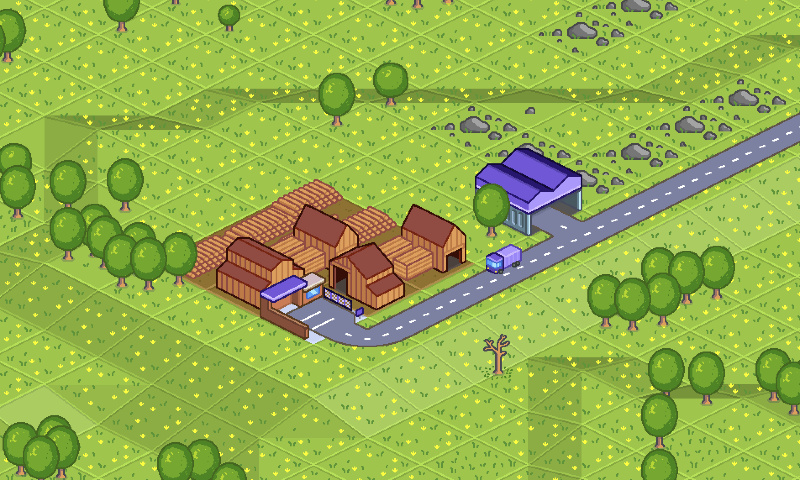

# BonkyGFX

BonkyGFX is an attempt to create a new base style for OpenTTD, replacing all sprites.
### Creating sprites
All sprites are drawn with [Aseprite](https://www.aseprite.org/).
### Building the NewGRF
You need to have [Aseprite](https://www.aseprite.org/) installed to build.
```
pip install -r requirements.txt
python3 generate.py
```